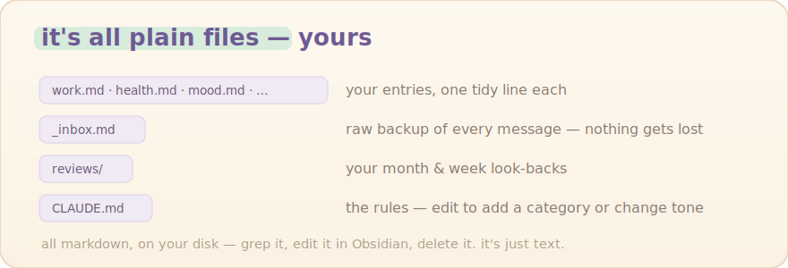
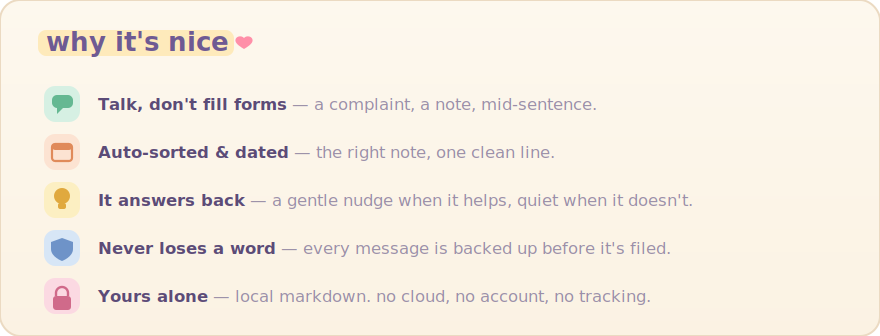
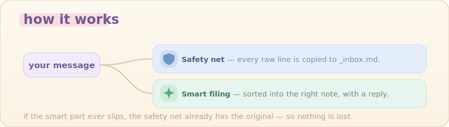

<div align="center">


<br><br>

**🌸 Just talk to it like a diary — a grumble, a tiny win, a stray thought.**
**It files what you said into the right note, and says something kind back.**

*No app. No forms. Just talk.*


<br>


<sub>💛 Example only — not real entries.</sub>

</div>

---

## ✨ How to use

**1 · Install** — once, inside Claude Code:

```text
/plugin marketplace add yuki4266/life-log
/plugin install life-log@yuki-tools
/reload-plugins
```

**2 · Make your diary** — open a new, empty folder and run:

```text
/life-log:setup
```

**3 · Just talk.** Whatever you say in that folder gets sorted, dated, filed, and answered. You never say "log this."

**4 · Look back** — anytime:

```text
/life-log:review
```

<sub>Needs Claude Code · <code>jq</code> optional (falls back to perl).</sub>

## 🗂️ What you get

<div align="center">



<br><br>



</div>

## 🔧 How it works

<div align="center">



</div>

## License

MIT — see [LICENSE](./LICENSE). Issues & PRs welcome at [`yuki4266/life-log`](https://github.com/yuki4266/life-log). 🌷
