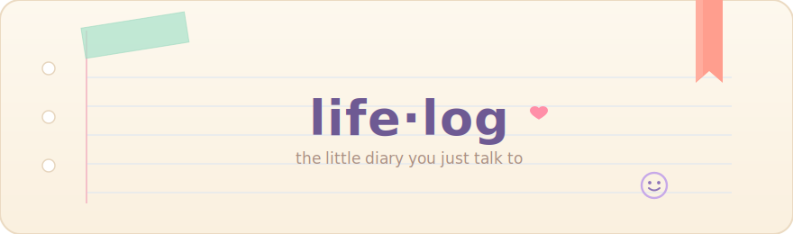
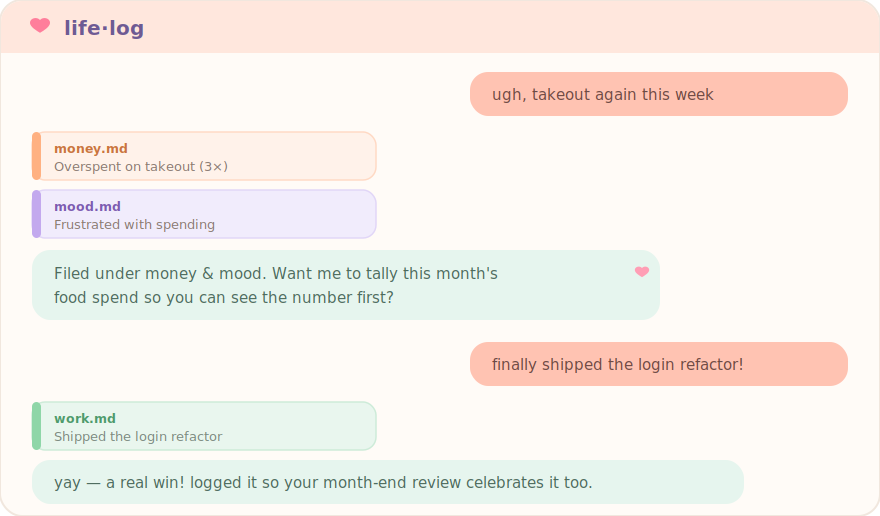

<div align="center">



<br><br>

**🌸 Just talk to it like a diary — a grumble, a tiny win, a stray thought.**
**It files what you said into the right note, and says something kind back.**

*No app. No forms. Just talk.*


<br>



<sub>💛 Example only — not real entries.</sub>

</div>

---

## ✨ How to use

**1 · Install** — once, inside Claude Code:

```text
/plugin marketplace add yuki4266/life-log
/plugin install life-log@yuki-tools
/reload-plugins
```

**2 · Make your diary** — open a new, empty folder and run:

```text
/life-log:setup
```

That's your whole diary: 8 notes, the recording rules, and a safety-net backup. It never overwrites anything.

**3 · Just talk.** Whatever you say in that folder gets sorted, dated, filed, and answered. You never say "log this."

**4 · Look back** — anytime:

```text
/life-log:review          # this month  (or: last week / June)
```

<sub>Needs Claude Code · `jq` optional (falls back to perl).</sub>

## 🗂️ It's all plain files — yours

| file | what's inside |
|---|---|
| `work.md` · `health.md` · `mood.md` · … | your entries, one tidy line each |
| `_inbox.md` | raw backup of every message — nothing gets lost |
| `reviews/` | your month & week look-backs |
| `CLAUDE.md` | the rules — edit to add a category or change the tone |

All markdown, on your disk. Grep it, edit it in Obsidian, delete it — it's just text.

## 💛 Why it's nice

- 💬 **Talk, don't fill forms** — a complaint, a note, mid-sentence.
- 🗂️ **Auto-sorted & dated** — the right note, one clean line.
- 💡 **It answers back** — a gentle suggestion when it helps, quiet when it doesn't.
- 🕸️ **Never loses a word** — every message is backed up before it's filed.
- 🔒 **Yours alone** — local markdown. No cloud, no account, no tracking.

## 🧩 What's inside

| skill | what it does |
|---|---|
| `/life-log:setup` | set up a new diary folder |
| `/life-log:log` | the auto-filing (runs on its own) |
| `/life-log:review` | read a month back to you, with suggestions |

## 🔧 How it works

Two little layers, so your words are both **safe** and **sorted**:

```text
your message ─┬─► 🕸️ safety net  ·  a hook copies the raw line to _inbox.md (never fails)
              └─► 🧠 smart filing  ·  Claude sorts it into the right note, then replies
```

If the smart part ever slips, the safety net already has the original. That's why nothing gets lost.

## 🔒 Privacy

Plain markdown on your machine — no cloud, no account, no telemetry. The hook only runs in folders you've set up. Your diary belongs to you completely.

## License

MIT — see [LICENSE](./LICENSE). Issues & PRs welcome at [`yuki4266/life-log`](https://github.com/yuki4266/life-log). 🌷
